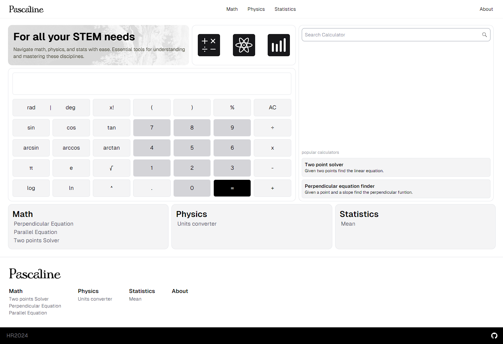

# 🌃 Pascaline - Open source calculators app



Pascaline is an open-source calculator project that provides powerful functionality for math, statistics, and physics calculations. Whether you're a student, professional, or enthusiast, Pascaline is designed to meet your computational needs with ease.

## Overview

Technologies used:

[](https://skillicons.dev)

The goal of the Pascaline project is to provide a comprehensive and user-friendly calculator for math, statistics, and physics, empowering users to perform a wide range of computations with ease and accuracy.

## Features

- **Math Functions:** Perform basic arithmetic operations, handle algebraic equations, and work with trigonometric functions.
  
- **Statistics Tools:** Analyze data sets, calculate averages, standard deviations, and perform statistical tests.

- **Physics Formulas:** Access a range of physics formulas for mechanics, thermodynamics, optics, and more.

## Project Status

This project is currently active and adding calculators constantly.

### Getting started

To use Pascaline, simply clone the repository to your local machine and open the index.html file in your web browser.

```bash
git clone https://github.com/Hctor11/pascaline.git
cd pascaline
```

## LICENSE
ascaline is licensed under the MIT License. See the LICENSE file for details.